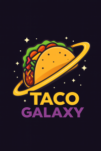
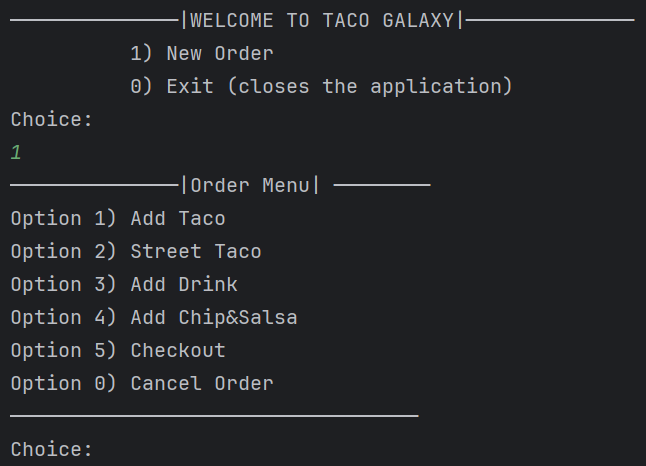
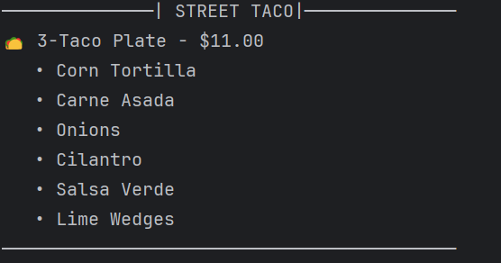
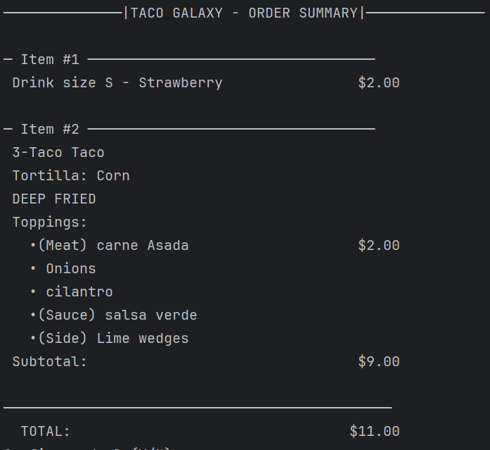

# 🌮 Taco Galaxy

Taco Galaxy is a Java-based console ordering application that allows users to build customized tacos, street tacos, drinks, chips & salsa.  
It features premium toppings, sauces, deep-fry options, and a full checkout summary with receipt generation.

---
## 🚀 Features

### ✔ Interactive Console Menu
Users can:
- Create new orders
- Add tacos or street tacos
- Add drinks
- Add chips & salsa
- Fully customize tacos (meats, cheese, sauces, toppings, sides, deep fry)
- View an order summary
- Generate a receipt

---

## 🖥 Application Screenshots

### **Main Menu**

### **Street Taco Screen**

### **Order Summary**

---

## 🏗 Project Structure

        if (meatToRemove != null) {
            toppings.remove(meatToRemove);
            streetTaco.addToppingPrice(-meatToRemove.getPrice()); //Add neg amount of the meat to didact from order price
            System.out.println("✓ Removed: " + meatToRemove.getName());
        }
This was my favorite piece of code because I neutralized the total by adding the negative value.